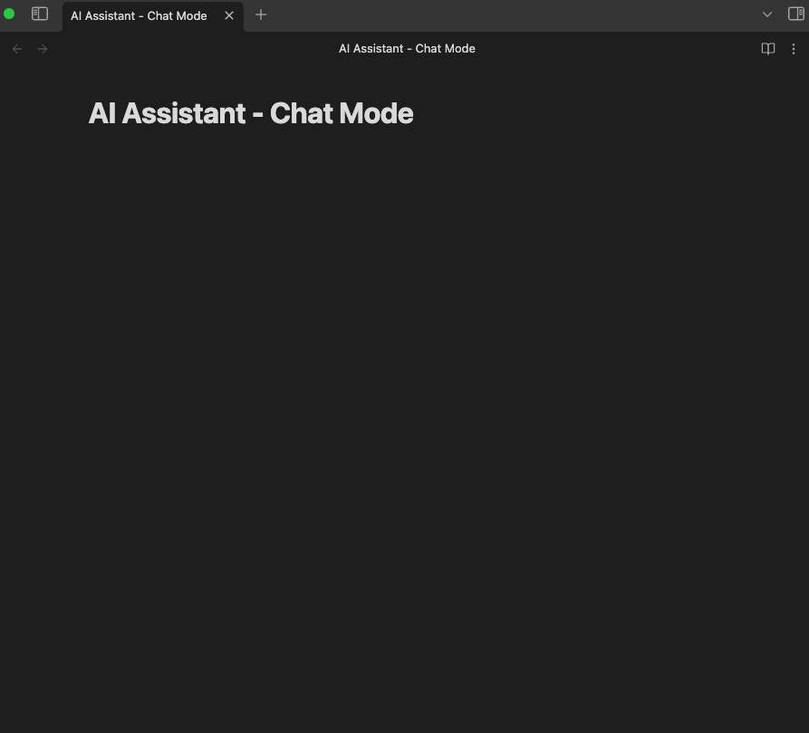
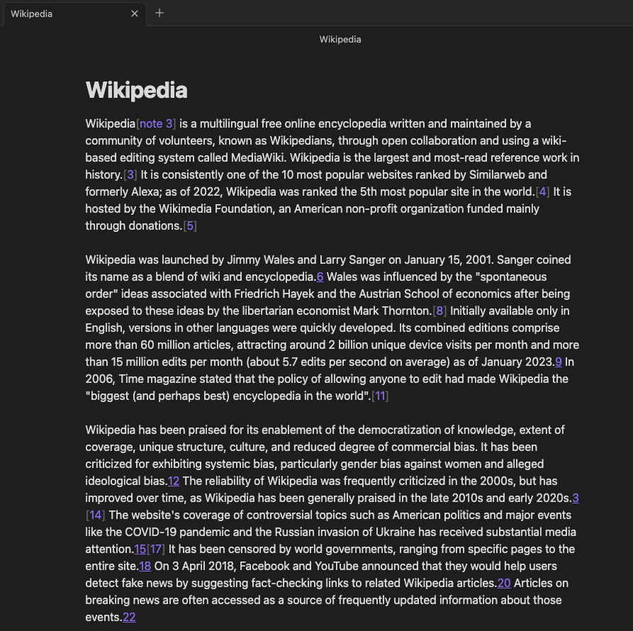

# Obsidian AI Assistant

Simple plugin to enable interactions with AI models such as [OpenAI ChatGPT](https://openai.com/blog/chatgpt), [OpenAI DALL·E](https://openai.com/product/dall-e-3), [OpenAI Whisper](https://openai.com/research/whisper) directly from your [Obsidian](https://obsidian.md/) notes.

The current available features of this plugin are:
- 🤖 Text assistant with GPT-4 and GPT-3.5 and GPT4-Vision,
- 🖼 Image generation with DALL·E3 and DALL·E2,
- 🗣 Speech to text with Whisper.

## Latest Updates
You can now upload images in the chat modal and start interacting with GPT4-Vision.

## How to use

### 🤖 Text Assistant

You have two commands to interact with the text assistant:
1. Chat mode,
2. Prompt mode.

|        Chat Mode         |       Prompt Mode         | 
|:------------------------:|:-------------------------:|
|   |  |

#### Chat mode
Chat with the AI assistant from your Vault to generate content for your notes.
From the chat, you can clic on any interaction to copy it directly to your clipboard.
You can also copy the whole conversation.
Chat mode now allows you to upload images to interact with GPT4-Vision.

#### Prompt mode
Prompt mode allows you to use a selected piece of text from your note as input for the assistant.
From here you can ask the assistant to translate, summarize, generate code ect.

### 🖼 Image Assistant
Generate images for your notes.\
In the result window, select the images you want to keep.\
They will automatically be downloaded to your vault and their path copied to your clipboard.\
Then, you can paste the images anywhere in your notes.

### 🗣 Speech to Text
Launch the Speech to Text command and start dictating your notes.\
The transcript will be immediately added to your note at your cursor location.

## Settings
### Text Assistant
- **Model choice**: choice of the text model. Currently `gpt-3.5-turbo`, `gpt-4-turbo` and `gpt-4` are supported.
- **Maximum number of tokens** in the generated answer
- **Replace or Add below**: In prompt mode, after having selected text from your note and enter your prompt, 
you can decide to replace your text by the assistant answer or to paste it bellow.

### Image Assistant
- You can switch between **DALL·E3** and **DALL·E2**,
- Change the default folder of generated images. 

### Speech to Text
- The model used is **Whisper**,
- You can change the default **language** to improve the accuracy and latency of the model. If you leave it empty, the model will automatically detect it.

## How to install

#### From the community plugins

You can install the [AI Assistant](https://obsidian.md/plugins?id=ai-assistant) directly from the Obsidian community plugins.

#### Get latest version from git
1. `cd path/to/vault/.obsidian/plugins`
2. `git clone https://github.com/qgrail/obsidian-ai-assistant.git && cd obsidian-ai-assistant`
3. `npm install && npm run build`
4. Open **Obsidian Preferences** -> **Community plugins**
5. Refresh Installed plugins and activate AI Assistant.

## Requirements

To use this plugin, you need an official API key from [OpenAI](https://platform.openai.com/account/api-keys).
